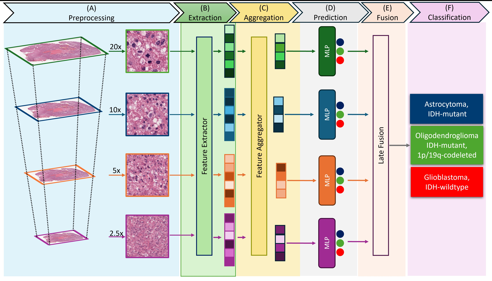
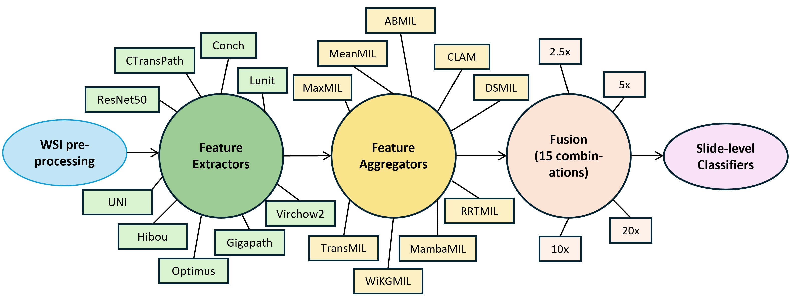

# Under Construction

# AI-driven WHO 2021 classification of gliomas based only on H&E-stained slides




The WHO 2021 classification criteria for adult-type diffuse glioma integrate histology with molecular profiling for conclusive diagnosis. Since molecular profiling can be expensive and time-consuming, often necessitating outsourcing or leading to the "not otherwise specified (NOS) label," this study develops an AI-driven WHO 2021 classification of gliomas solely from H&E whole-slide images (WSIs).


## Environment
### Pre-requisites
* Linux (Tested on Ubuntu 22.04)
* NVIDIA GPU (Tested on Nvidia A6000/A100)

Next, use the environment configuration file to create a conda environment:
```bash
conda env create -n glioma_subtyping -f glioma_subtyping.yaml
```

Activate the environment:
```bash
conda activate glioma_subtyping
```

## WSI Patching and Curation

```bash
data/slides_20x/
	├── patient_1_slide_a.svs
	├── patient_1_slide_b.svs
	└── ...
data/slides_40x/
	├── patient_2_slide_a.svs
	├── patient_2_slide_b.svs
	└── ...
```


### 🛠 Workflow Logic

The pipeline automatically adjusts the extraction scale and file paths based on the input magnification. 
This ensures that the physical area covered by a patch remains consistent or follows your specific protocol.

| Input Argument | Target Data Directory | Output Directory | Patch Size | Down Sample Level |
| :--- | :--- | :--- | :--- | :--- |
| `40x` | `data/slides_40x/` | `data/slides_patches/` | **512** | `2` |
| `20x` | `data/slides_20x/` | `data/slides_patches/` | **256** | `1` | 


### Patch Creation at Multiple Magnifications

Some datasets provide Whole Slide Images (WSIs) with pyramid downsample levels  
`1, 2, 4, 8, 16`.  
We map these levels to effective optical magnifications as follows:

| Pyramid Level | Effective Magnification |
|--------------:|-------------------------|
| 1             | 40x (native resolution) |
| 2             | 20x                     |
| 4             | 10x                     |
| 8             | 5x                      |
| 16            | 2.5x                    |

Based on this mapping, patches are extracted using the following conventions:

- **20x / 10x / 5x / 2.5x**  
  - `step_size = 256`  
  - `patch_size = 256`  
- **40x**  
  - `step_size = 512`  
  - `patch_size = 512`

---

#### Create Patches Script

The `create_patches.sh` script takes the following arguments:

```bash
./create_patches.sh <DATASET> <MAG> <PATCH_SIZE> <PATCH_LEVEL>

Examples: 
./create_patches.sh tcga 20x 256 2 #20x (Pyramid Level = 2)
./create_patches.sh tcga 10x 256 4 #10x (Pyramid Level = 4)
./create_patches.sh tcga 5x 256 8 #5x (Pyramid Level = 8)
./create_patches.sh tcga 2.5x 256 16 #2.5x (Pyramid Level = 16)
```


#### Output Directory Structure
```bash
data/patches/<DATASET>/<MAG>/
	├── masks
    		├── patient_1_slide_a.png
    		├── patient_1_slide_b.png
    		└── ...
	├── patches
    		├── patient_1_slide_a.h5
    		├── patient_1_slide_b.h5
    		└── ...
	├── stitches
    		├── patient_1_slide_a.png
    		├── patient_1_slide_b.png
    		└── ...
	└── slides_processed.csv
```

### 🧹 Patch Cleanup (Step 2)
After initial patching, the pipeline runs a **Cleanup Script** to filter out low-quality tiles. (if needed)
#### Filtering Criteria:
1. **White Space**: Patches with >85% background are removed.
2. **Stain Detection**: Uses HED (Hematoxylin-Eosin-DAB) color deconvolution to ensure tissue is actually present.
3. **HSV Filtering**: Removes blurry or out-of-focus areas based on saturation and value thresholds.

After patch extraction, a cleanup step is performed to remove invalid or unused patches based on the patching magnification.
Run the cleanup script as follows:

```bash
python step_2_cleanup.py \
    --wsi_dir "$DATA_DIR" \
    --h5_dir "$COORD_DIR/patches" \
    --csv_path "$COORD_DIR/slides_processed.csv" \
    --patching "$MAG"
```
Arguments:
- `--wsi_dir` : directory containing the original WSI files
- `--h5_dir` : directory containing extracted patch coordinate `.h5` files
- `--csv_path` — CSV file generated during patch creation (`slides_processed.csv`)
- `--patching` — magnification level used for patch extraction (e.g., `20x`, `10x`, `5x`, `2.5x`)


## Creating Features
Run the extraction script by specifying magnification, batch size, and the desired model backbone. The script dynamically maps to the correct data and coordinate directories based on the magnification provided.

### Usage
```shell
./extract_features.sh <MAG> <BATCH_SIZE> <BACKBONE>
```
Example: 
```shell
./extract_features.sh 20x 256 uni
```

### Supported Backbones

We support several **state-of-the-art self-supervised and supervised models** for histopathology.  
For more details about each model, please refer to the original repositories to request access and follow their specific licensing terms.

- **ReNet-50** : ImageNet pretrained 
- **CTransPath** : [https://github.com/Xiyue-Wang/TransPath](https://github.com/Xiyue-Wang/TransPath)
- **Lunit ViT** : [https://github.com/lunit-io/benchmark-ssl-pathology](https://github.com/lunit-io/benchmark-ssl-pathology)
- **UNI** : [https://github.com/mahmoodlab/UNI](https://github.com/mahmoodlab/UNI)
- **Conch** : [https://github.com/mahmoodlab/CONCH](https://github.com/mahmoodlab/CONCH)
- **Gigapath** : [https://github.com/prov-gigapath/prov-gigapath](https://github.com/prov-gigapath/prov-gigapath)
- **Hibou** : [https://github.com/HistAI/hibou](https://github.com/HistAI/hibou)
- **Optimus** : [https://github.com/bioptimus/releases/tree/main/models/h-optimus/v0](https://github.com/bioptimus/releases/tree/main/models/h-optimus/v0)
- **Virchow2** : [https://huggingface.co/paige-ai/Virchow2](https://huggingface.co/paige-ai/Virchow2)

## Training the models


### Usage Instructions
To run the training script, pass the **magnification level** and **backbone name** as arguments:
```bash
chmod +x train.sh
./train.sh <MAG> <BACKBONE>
```

Example: 
```bash
./train.sh 20x uni
```


## Evaluation 
To run the evaluation script, pass the **magnification level** and **backbone name** as arguments:
```bash
chmod +x eval.sh
./eval.sh <MAG> <BACKBONE>
```

Example: 
```bash
./eval.sh 20x uni
```

### Acknowledgement
This codebase is heavily based on [CLAM](https://github.com/mahmoodlab/CLAM/) and [MambaMIL](https://github.com/isyangshu/MambaMIL). We are grateful to the authors for their open-source work.

This code is available for research and non-commercial academic purposes only. Please ensure you review the original repository licensing for any foundation models used, as well as the licensing terms for the two repositories mentioned above.


## Citations

Shubham Innani, W Robert Bell, MacLean P Nasrallah, Bhakti Baheti, Spyridon Bakas, AI-driven WHO 2021 classification of gliomas based only on H&E-stained slides, Neuro-Oncology, 2025;, noaf189, https://doi.org/10.1093/neuonc/noaf189

```bash
@article{10.1093/neuonc/noaf189,
    author = {Innani, Shubham and Bell, W Robert and Nasrallah, MacLean P and Baheti, Bhakti and Bakas, Spyridon},
    title = {AI-driven WHO 2021 classification of gliomas based only on H\&amp;E-stained slides},
    journal = {Neuro-Oncology},
    pages = {noaf189},
    year = {2025},
    month = {08},
    abstract = {},
    issn = {1522-8517},
    doi = {10.1093/neuonc/noaf189},
    url = {https://doi.org/10.1093/neuonc/noaf189},
    eprint = {https://academic.oup.com/neuro-oncology/advance-article-pdf/doi/10.1093/neuonc/noaf189/64170409/noaf189.pdf},
}
```
