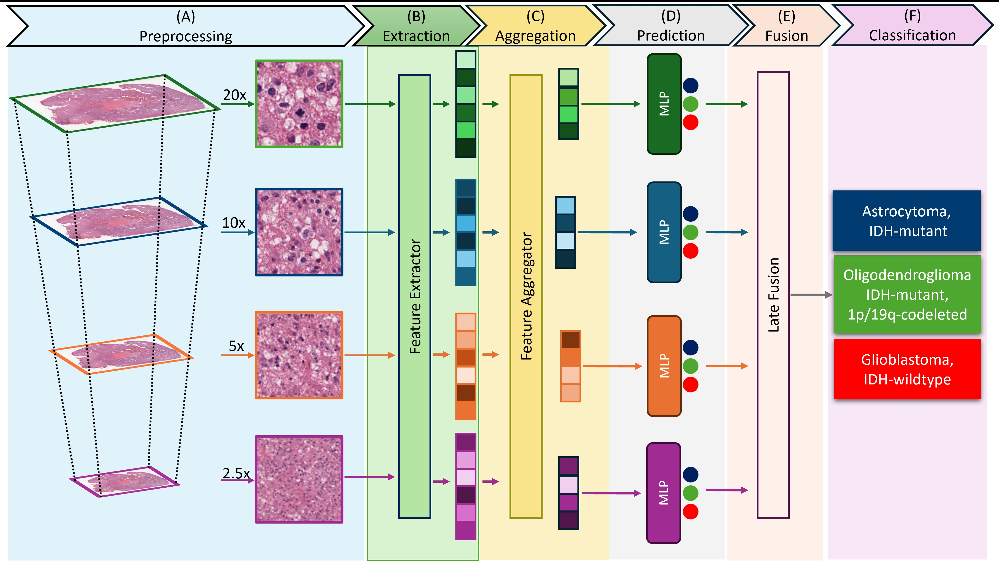
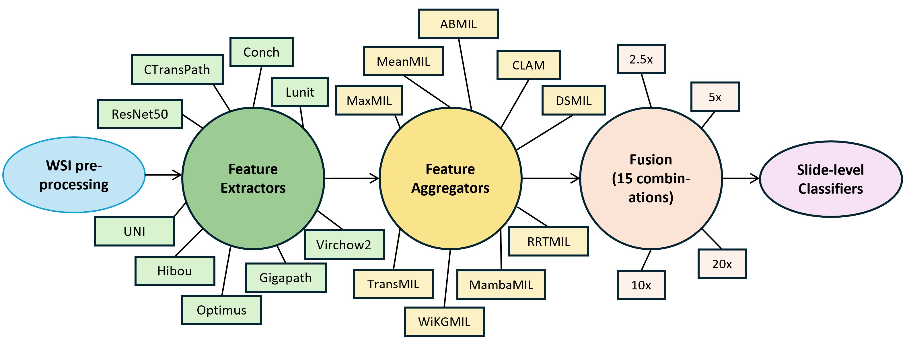

# AI-driven WHO 2021 classification of gliomas based only on H&E-stained slides




The WHO 2021 classification criteria for adult-type diffuse glioma integrate histology with molecular profiling for conclusive diagnosis. Since molecular profiling can be expensive and time-consuming, often necessitating outsourcing or leading to the "not otherwise specified (NOS) label," this study develops an AI-driven WHO 2021 classification of gliomas solely from H&E whole-slide images (WSIs).


## Environment
### Pre-requisites
* Linux (tested on Ubuntu 22.04 / WSL2)
* NVIDIA GPU (tested on A6000, A100, RTX 6000 Ada), driver supporting CUDA 11.8

One command creates the pinned conda environment (`environment.yml` + `requirements.txt`: Python 3.10, PyTorch 2.0.1+cu118, OpenSlide) and compiles the bundled Mamba CUDA kernels (`mamba/`, from [MambaMIL](https://github.com/isyangshu/MambaMIL)):
```bash
scripts/setup_env.sh          # optional arg: GPU compute capability, e.g. 8.0
conda activate glioma_subtyping
pytest                        # unit tests (+ Mamba forward pass on GPU)
```

### Smoke test (end to end on 2 slides)
Runs patching, ResNet-50 feature extraction, training, evaluation and multi-magnification late fusion for `att_mil`, `mamba_mil` and `clam_sb` (no gated weights needed). Labels and splits are dummies, so only the plumbing is checked:
```bash
scripts/smoke_test.sh /path/to/slides            # first 2 slides in the folder (~1 min on a GPU)
scripts/smoke_test.sh a.svs b.svs                # or explicit files
```
It ends with `SMOKE TEST PASSED` after `tools/check_smoke_outputs.py` verifies every artifact.

### Access tokens for gated foundation models
Several foundation models (UNI, CONCH, Virchow2, Hibou, ...) are gated on Hugging Face. Request access on each model page, then export your token in the shell **before** running feature extraction. Tokens are never stored in this repository:

```bash
export HF_TOKEN=<your_hugging_face_token>
```

## Repository layout

| Path | Purpose |
|------|---------|
| `pipeline/create_patches_fp.py`, `pipeline/step_1a_patch_cleaning.py`, `wsi_core/` | Tissue segmentation, patch coordinates, patch cleanup (from CLAM) |
| `pipeline/extract_features_fp*.py`, `models/builder.py` | Patch-level feature extraction with each foundation model |
| `models/`, `modules/` | MIL aggregators (CLAM, MambaMIL, TransMIL, DSMIL, WiKG, RRT, ...) |
| `pipeline/main.py`, `pipeline/main_clam.py`, `pipeline/eval.py`, `pipeline/ensemble_script.py` | Cross-validated training, evaluation, multi-magnification late fusion |
| `pipeline/create_heatmaps.py`, `vis_utils/` | Attention heatmaps for interpretability |
| `tools/`, `docs/` | Splitting, preset and plotting helpers; paper figures |
| `dataset_csv/`, `splits/`, `presets/` | Labels, train/val/test folds, segmentation presets |
| `scripts/` | Shell drivers for each pipeline stage (`scripts/slurm/` has a cluster template). **Run them from the repository root.** |

## WSI Patching and Curation

```bash
data/wsi/<DATASET>
	├── patient_1_slide_a.svs
	├── patient_1_slide_b.svs
	└── ...
data/wsi/<DATASET>
	├── patient_2_slide_a.svs
	├── patient_2_slide_b.svs
	└── ...
```


### Patching at a target magnification
`create_patches_fp.py --target_mag 20` resolves the pyramid level **per slide** from its native objective power (20x- and 40x-native TCGA slides are handled in one run). If a slide has no level at the target (e.g. a 40x slide without a 20x level), it is read at the finer level with a proportionally larger window (512 px for 256 px at 20x) and resized by the feature extractor, so every patch covers the same tissue area. Tissue segmentation presets live in `presets/`; use `bwh_biopsy.csv` for small or sparse specimens.

#### Create Patches Script
```bash
scripts/patches/create_patches.sh <DATASET> <MAG> [PRESET]
scripts/patches/create_patches.sh tcga 20x      # also 10x, 5x, 2.5x
```
Slides are read from `data/wsi/<DATASET>/` (override with `WSI_ROOT`).

#### Output Directory Structure
```bash
data/patches/<DATASET>/<MAG>/
	├── masks
    		├── patient_1_slide_a.png
    		├── patient_1_slide_b.png
    		└── ...
	├── patches
    		├── patient_1_slide_a.h5
    		├── patient_1_slide_b.h5
    		└── ...
	├── stitches
    		├── patient_1_slide_a.png
    		├── patient_1_slide_b.png
    		└── ...
	└── slides_processed.csv
```

### 🧹 Patch Cleanup (Step 2)
After initial patching, the pipeline runs a **Cleanup Script** to filter out low-quality tiles. (if needed)
#### Filtering Criteria:
1. **White Space**: Patches with >85% background are removed.
2. **Stain Detection**: Uses HED (Hematoxylin-Eosin-DAB) color deconvolution to ensure tissue is actually present.
3. **HSV Filtering**: Removes blurry or out-of-focus areas based on saturation and value thresholds.

After patch extraction, a cleanup step is performed to remove invalid or unused patches based on the patching magnification.
Run the cleanup script as follows:

```bash
python pipeline/step_1a_patch_cleaning.py \
    --wsi_dir "$DATA_DIR" \
    --h5_dir "$COORD_DIR/patches" \
    --csv_path "$COORD_DIR/slides_processed.csv" \
    --patching "$MAG"
```
Arguments:
- `--wsi_dir` : directory containing the original WSI files
- `--h5_dir` : directory containing extracted patch coordinate `.h5` files
- `--csv_path` — CSV file generated during patch creation (`slides_processed.csv`)
- `--patching` — magnification level used for patch extraction (e.g., `20x`, `10x`, `5x`, `2.5x`)


## Creating Features
This script performs **patch-level feature extraction** using a selected backbone model.  
It supports multiple **self-supervised and supervised histopathology encoders** and automatically selects the appropriate feature-extraction wrapper.


### Usage
```bash
./scripts/features/create_features.sh <MAG> <BATCH_SIZE> <CSV_FILE> <BACKBONE> <DATASET>
``` 

Example: 
```shell
chmod +x features/create_features.sh
./scripts/features/create_features.sh 20x 128 tcga_2021_who_labels.csv uni tcga
```

Arguments:
- `MAG` — magnification level (e.g., `20x`, `10x`, `5x`, `2.5x`)
- `BATCH_SIZE` — batch size for feature extraction (e.g., `128`)
- `CSV_FILE` — dataset CSV file (located in `dataset_csv/`)
- `BACKBONE` — feature extractor backbone
- `DATASET` — dataset name (e.g., `tcga`, `ebrains`, `ipd`)


### Supported Backbones

We support several **state-of-the-art self-supervised foundation models** for histopathology.  
For more details about each model, please refer to the original repositories to request access and follow their specific licensing terms.

- **ResNet-50** : ImageNet pretrained 
- **CTransPath** : [https://github.com/Xiyue-Wang/TransPath](https://github.com/Xiyue-Wang/TransPath)
- **Lunit ViT** : [https://github.com/lunit-io/benchmark-ssl-pathology](https://github.com/lunit-io/benchmark-ssl-pathology)
- **UNI** : [https://github.com/mahmoodlab/UNI](https://github.com/mahmoodlab/UNI)
- **Conch** : [https://github.com/mahmoodlab/CONCH](https://github.com/mahmoodlab/CONCH)
- **Gigapath** : [https://github.com/prov-gigapath/prov-gigapath](https://github.com/prov-gigapath/prov-gigapath)
- **Hibou** : [https://github.com/HistAI/hibou](https://github.com/HistAI/hibou)
- **Optimus** : [https://github.com/bioptimus/releases/tree/main/models/h-optimus/v0](https://github.com/bioptimus/releases/tree/main/models/h-optimus/v0)
- **Virchow2** : [https://huggingface.co/paige-ai/Virchow2](https://huggingface.co/paige-ai/Virchow2)


#### Output Directory Structure
```bash
data/features/<BACKBONE>/<DATASET>/<MAG>/
    ├── h5_files/
  │   ├── slide_1.h5
  │   ├── slide_2.h5
  │   └── ...
  └── pt_files/
      ├── slide_1.pt
      ├── slide_2.pt
      └── ...
```
`.h5` files contain patch features with coordinates while `.pt` files contain serialized tensors for faster downstream training. 

## 🛠 Related Toolboxes
While this repository focuses on specific glioma subtyping  [TRIDENT](https://github.com/mahmoodlab/TRIDENT) provides several large-scale toolkits designed for high-throughput Whole-Slide Image (WSI) processing and benchmarking. [TRIDENT](https://github.com/mahmoodlab/TRIDENT) is the next-generation successor to toolkits like [CLAM](https://github.com/mahmoodlab/CLAM/), offering a more robust and scalable pipeline for giga-pixel image analysis. 


## Training the models

### 🧠 Supported MIL Models

The training script supports the following Multiple Instance Learning (MIL) model architectures.
Use any of these as the `<MODEL>` argument when running `scripts/train.sh`.

| Model Name | Description | Original Repository |
|-----------|-------------| ----------------------|
| `mean_mil` | Mean pooling MIL baseline | [https://github.com/jakubmonhart/mil_pytorch](https://github.com/jakubmonhart/mil_pytorch) |
| `max_mil` | Max pooling MIL baseline | [https://github.com/jakubmonhart/mil_pytorch](https://github.com/jakubmonhart/mil_pytorch) |
| `att_mil` | Attention-based MIL | [https://github.com/AMLab-Amsterdam/AttentionDeepMIL](https://github.com/AMLab-Amsterdam/AttentionDeepMIL) |
| `trans_mil` | Transformer-based MIL |  [https://github.com/szc19990412/TransMIL](https://github.com/szc19990412/TransMIL) |
| `clam_sb` | Attention-based MIL with instance clustering | [https://github.com/mahmoodlab/CLAM/](https://github.com/mahmoodlab/CLAM/) |
| `mamba_mil` | Mamba-based state space MIL |  [https://github.com/isyangshu/MambaMIL](https://github.com/isyangshu/MambaMIL) |
| `dsmil` | Dual-Stream MIL | [https://github.com/binli123/dsmil-wsi](https://github.com/binli123/dsmil-wsi) |
| `wikgmil` | WIKG-MIL graph-based model | [https://github.com/WonderLandxD/WiKG/](https://github.com/WonderLandxD/WiKG/) |
| `rrtmil` | RRT-based MIL architecture | [https://github.com/DearCaat/RRT-MIL](https://github.com/DearCaat/RRT-MIL) |


### Usage Instructions
To run the training script, pass the **magnification level** and **backbone name** as arguments:
```bash
chmod +x scripts/train.sh
./scripts/train.sh <BACKBONE> <MODEL> <MAG>
```

Example: 
```bash
./scripts/train.sh virchow trans_mil 20x
./scripts/train.sh uni mamba_mil 10x
./scripts/train.sh gigapath wikgmil 5x
```

To iterate over all the models, as well as backbone along with the magnification:
```bash
chmod +x scripts/train.sh

# The Triple Loop
for bb in uni imagenet hibou ctranspath lunit conch_v1 gigapath optimus virchow; do
    for model in mean_mil max_mil att_mil trans_mil clam_sb mamba_mil dsmil wikgmil rrtmil; do
        for mag in 20x 10x 5x 2.5x; do
            echo "------------------------------------------------"
            echo "RUNNING: Backbone: $bb | Model: $model | Mag: $mag"
            ./scripts/train.sh "$bb" "$model" "$mag"
        done
    done
done
```

## Evaluation 
To run the evaluation script, pass the **magnification level** and **backbone name** as arguments:
```bash
BACKBONES=("uni" "imagenet" "hibou" "ctranspath" "lunit" "conch_v1" "gigapath" "optimus" "virchow")
MODELS=("mean_mil" "max_mil" "att_mil" "trans_mil" "clam_sb" "mamba_mil" "dsmil" "wikgmil" "rrtmil")
MAGS=("20x" "10x" "5x" "2.5x")

chmod +x scripts/eval.sh

# The Master Loop
for bb in "${BACKBONES[@]}"; do
    for model in "${MODELS[@]}"; do
        for mag in "${MAGS[@]}"; do
            echo "------------------------------------------------"
            echo "EVALUATING: Backbone: $bb | Model: $model | Mag: $mag"
            ./scripts/eval.sh "$model" "$bb" "$mag"
        done
    done
done

```

Example: 
```bash
./scripts/eval.sh mamba_mil uni 20x
./scripts/eval.sh rrtmil gigapath 10x
./scripts/eval.sh att_mil virchow 5x
./scripts/eval.sh wikgmil optimus 2.5x
```

#### Output Directory Structure
```bash
eval_results/
└── tcga/              # <--- dataset_LABEL
    └── uni/                      # <--- BACKBONE (Foundation Model)
        └── mamba_mil/            # <--- MODEL (Architecture)
            ├── 20x/              # <--- mag (Magnification)
            │   ├── fold_0.csv    # <--- Slide-level results for Fold 0
            │   ├── fold_1.csv
            │   └── ...
            ├── 10x/
            └── ...
```
## Late Fusion (Multi-Magnification Ensembles)
Late fusion aggregates predictions from multiple magnifications (e.g. 2.5x, 5x, 10x, 20x) by averaging class probabilities at the slide level, followed by argmax to obtain final predictions.
This is performed after model inference, using precomputed evaluation CSVs.

To run late fusion across all backbones, models, and datasets, use:
```bash
chmod +x scripts/eval_ensemble.sh
./scripts/eval_ensemble.sh who2021
```

#### Output Directory Structure 
```bash
<dataset>_who2021/<BACKBONE>/<MODEL>/
└── 5x_10x_20x/
    ├── EVAL_tcga_2021_tcga_3_class_5x_10x_20x_test/
    │   ├── fold_0.csv
    │   └── ...
    └── EVAL_tcga_idh_5x_10x_20x_eval_results_detailed.csv
```

### Acknowledgement
This codebase is heavily based on [CLAM](https://github.com/mahmoodlab/CLAM/) and [MambaMIL](https://github.com/isyangshu/MambaMIL). We are grateful to the authors for their open-source work.

This code is available for research and non-commercial academic purposes only. Please ensure you review the original repository licensing for any foundation models used, as well as the licensing terms for the two repositories mentioned above.


## Citations

Shubham Innani, W Robert Bell, MacLean P Nasrallah, Bhakti Baheti, Spyridon Bakas, AI-driven WHO 2021 classification of gliomas based only on H&E-stained slides, Neuro-Oncology, 2025;, noaf189, https://doi.org/10.1093/neuonc/noaf189

```bash
@article{10.1093/neuonc/noaf189,
    author = {Innani, Shubham and Bell, W Robert and Nasrallah, MacLean P and Baheti, Bhakti and Bakas, Spyridon},
    title = {AI-driven WHO 2021 classification of gliomas based only on H\&amp;E-stained slides},
    journal = {Neuro-Oncology},
    pages = {noaf189},
    year = {2025},
    month = {08},
    abstract = {},
    issn = {1522-8517},
    doi = {10.1093/neuonc/noaf189},
    url = {https://doi.org/10.1093/neuonc/noaf189},
    eprint = {https://academic.oup.com/neuro-oncology/advance-article-pdf/doi/10.1093/neuonc/noaf189/64170409/noaf189.pdf},
}
```
